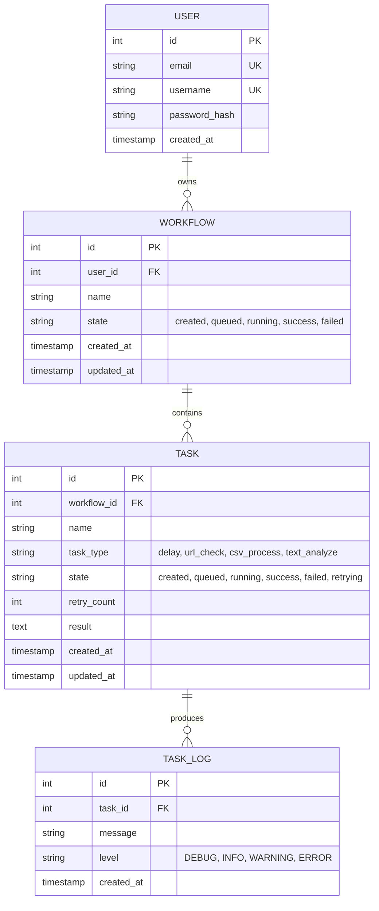

# Database Schema

## Entity Relationship Diagram

## Tables

### `users`

Registered users with authentication credentials.

| Column | Type | Constraints | Notes |
| -------- | ------ | ------------- | ------- |
| id | int | PK, auto-increment | |
| email | string(255) | NOT NULL, UNIQUE | Login identifier |
| username | string(100) | NOT NULL, UNIQUE | Display name |
| password_hash | string(255) | NOT NULL | Bcrypt hash, never plaintext |
| created_at | timestamp (UTC) | NOT NULL, DEFAULT utcnow() | Immutable |

**Relationships:**

- `workflows`: one-to-many with `workflows.user_id`, cascade delete

### `workflows`

Orchestration jobs created and owned by users.

| Column | Type | Constraints | Notes |
| -------- | ------ | ------------- | ------- |
| id | int | PK, auto-increment | |
| user_id | int | FK → users.id, NOT NULL | On delete: CASCADE |
| name | string(255) | NOT NULL | User-friendly name (e.g., "Process Batch 1") |
| state | enum (WorkflowState) | NOT NULL, DEFAULT 'created' | Values: created, queued, running, success, failed |
| created_at | timestamp (UTC) | NOT NULL, DEFAULT utcnow() | Immutable |
| updated_at | timestamp (UTC) | NOT NULL, DEFAULT utcnow() | Updated on state change |

**State Enum Values:**

- `created`: Initial state after creation
- `queued`: All tasks enqueued to worker
- `running`: At least one task is executing
- `success`: All tasks succeeded
- `failed`: One or more tasks failed after retries exhausted

**Indexes:**

- `ix_workflows_user_id` on `user_id`
- `ix_workflows_state` on `state`
- `ix_workflows_user_state` on `(user_id, state)`

**Relationships:**

- `user`: many-to-one with `users.id`
- `tasks`: one-to-many with `tasks.workflow_id`, cascade delete

### `tasks`

Individual units of work within a workflow. State transitions follow strict rules (see state-machine.md).

| Column | Type | Constraints | Notes |
| -------- | ------ | ------------- | ------- |
| id | int | PK, auto-increment | |
| workflow_id | int | FK → workflows.id, NOT NULL | On delete: CASCADE |
| name | string(255) | NOT NULL | Task description (e.g., "Wait 3 seconds") |
| task_type | string(100) | NOT NULL | Handler type: delay, url_check, csv_process, text_analyze |
| state | enum (TaskState) | NOT NULL, DEFAULT 'created' | Values: created, queued, running, success, failed, retrying |
| retry_count | int | NOT NULL, DEFAULT 0 | Incremented on failure; max 3 retries; constraint: >= 0 |
| result | text | nullable | Handler output as JSON string: `{status: str, message: str, data: any}` |
| created_at | timestamp (UTC) | NOT NULL, DEFAULT utcnow() | Immutable |
| updated_at | timestamp (UTC) | NOT NULL, DEFAULT utcnow() | Updated on state change or retry |

**State Enum Values:**

- `created`: Initial state after materialization
- `queued`: Enqueued to Celery
- `running`: Worker picked up task
- `success`: Handler returned success
- `failed`: Handler failed, no more retries
- `retrying`: Scheduled for retry after backoff

**Constraints:**

- `ck_tasks_retry_count_non_negative`: `retry_count >= 0`

**Indexes:**

- `ix_tasks_workflow_id` on `workflow_id`
- `ix_tasks_state` on `state`
- `ix_tasks_workflow_state` on `(workflow_id, state)`

**Relationships:**

- `workflow`: many-to-one with `workflows.id`
- `task_logs`: one-to-many with `task_logs.task_id`, cascade delete

### `task_logs`

Append-only event log for task execution. No updates or deletes after insertion except via cascade.

| Column | Type | Constraints | Notes |
| -------- | ------ | ------------- | ------- |
| id | int | PK, auto-increment | |
| task_id | int | FK → tasks.id, NOT NULL | On delete: CASCADE |
| message | text | NOT NULL | Log entry text |
| level | string(20) | NOT NULL, DEFAULT 'INFO' | Values: DEBUG, INFO, WARNING, ERROR |
| created_at | timestamp (UTC) | NOT NULL, DEFAULT utcnow() | Immutable |

**Indexes:**

- `ix_task_logs_task_id` on `task_id`
- `ix_task_logs_created_at` on `created_at`

**Relationships:**

- `task`: many-to-one with `tasks.id`

## Key Constraints

- **Referential Integrity**: All FKs use `ON DELETE CASCADE` to clean up orphaned rows.
- **Ownership**: All workflows and their tasks are scoped to the owning user; queries always include `WHERE workflow.user_id = ?` or `WHERE user_id = ?`.
- **Audit Trail**: `created_at` is immutable; `updated_at` is set on insert and updated on each state change.
- **Task Logs**: Append-only; no UPDATE or DELETE operations except cleanup via cascade.
- **State Enums**: Implemented as SQLAlchemy-backed `StrEnum` values; Python-level transition helpers in `domain.workflow_state` (`can_transition_workflow`, `can_transition_task`) are the source of truth for legal transitions.
- **Timestamps**: All use UTC timezone and `utcnow()` factory function.
